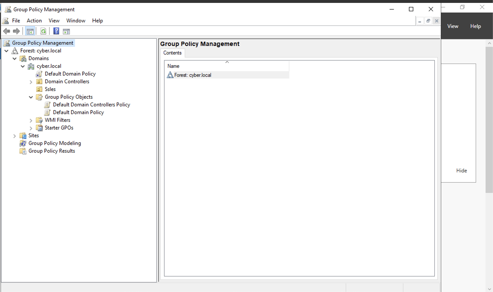
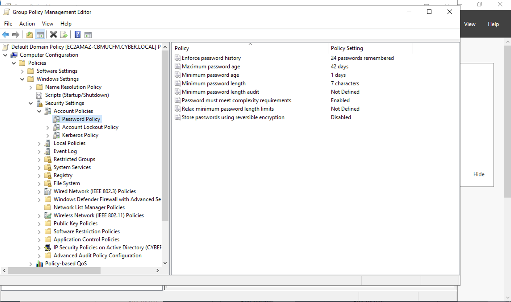

# Creating a Password Policy 🔐
-This lab illustrates how to configure **Password Policies** on an AD Server
### Step 1: Configuring a Password Policy
- Configuring a **Password Policy** requires us to navigate to **Group Policy Management**
- On the top right of the **Server Manager** select **Tools** -> navigate to and click on **Group Policy Management**

- We're going to edit the **Default Domain Policy** by expanding the tabs in the forest and **Right** clicking on the **Default Domain Policy**(By edititing the Password Policy underneath the Default Domain Policy, the change will affect everything in the cyber.local Domain)
### Step 2:
- To navigate to the **Password Policy** Expand **Computer Configuration** -> **Windows Settings** -> **Security Settings** -> **Account Policies** -> **Password Policies**
### Step 3:
- And from there, you'll be able to configure the Password Policy to your desired needs

## Demo Video🎥
-[Password Policy Demo](https://www.loom.com/share/3949747383d94dae8068a05596be9cdf?sid=69561ed1-5799-4047-8b60-dbd364882200)
